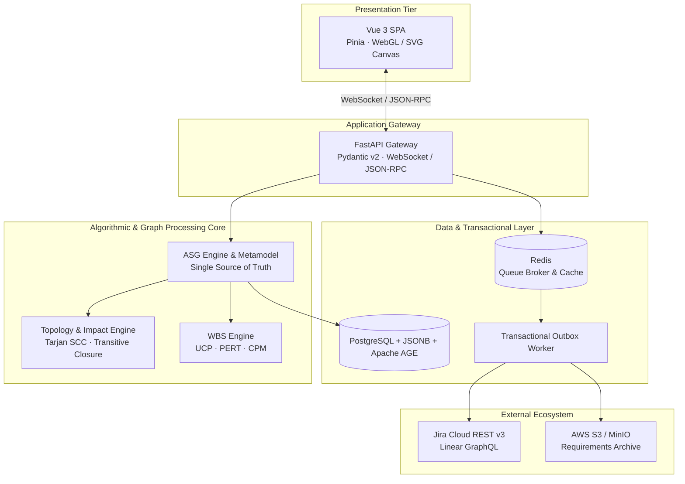
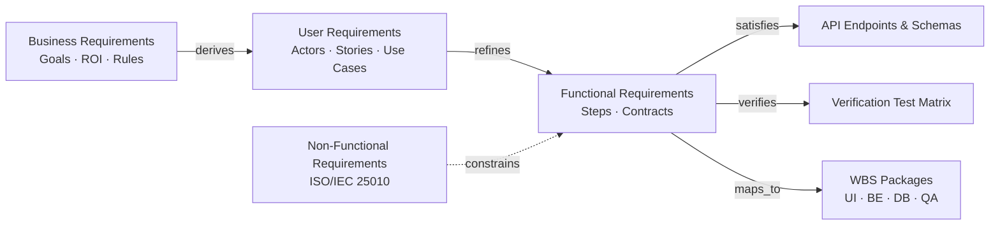
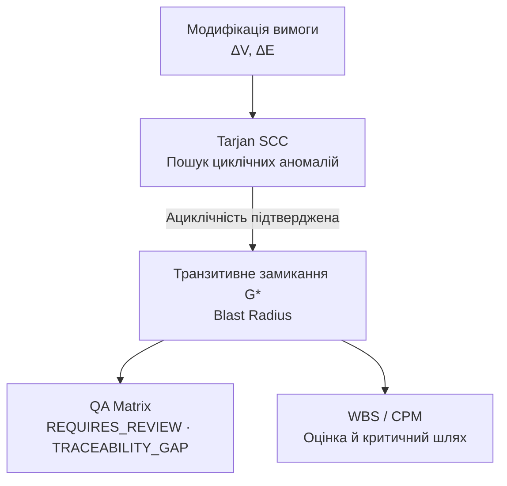

<div align="center">

# UseTrace Studio

### Розробка розподіленої системи наскрізного моделювання та трасування вимог до програмного забезпечення на основі семантичних графів із забезпеченням транзакційної узгодженості та автоматизованим оцінюванням трудовитрат

*Enterprise Requirements Lifecycle, Visual Modeling & WBS Engine*

</div>

> **Галузь знань:** 12 «Інформаційні технології»  
> **Спеціальність:** F2 (121) «Інженерія програмного забезпечення»  
> **Інститут / кафедра:** кафедра ПЗКС, ННІ ФТКН ЧНУ  
> **Виконавець:** Сусла Владислав Валерійович, 4 курс, група F2  
> **Науковий керівник:** Комісарчук Володимир Васильович, к. т. н., доцент  
> **Docs-as-Code репозиторій:** [Vlad8800/F2-diploma-project](https://github.com/Vlad8800/F2-diploma-project)

---

## Зміст

- [Паспорт кваліфікаційного проєкту](#паспорт-кваліфікаційного-проєкту)
- [Актуальність та інженерна проблема](#актуальність-та-інженерна-проблема)
- [Об’єкт, предмет і мета](#обєкт-предмет-і-мета)
- [Архітектурна концепція](#архітектурна-концепція)
- [Багаторівнева графова метамодель](#багаторівнева-графова-метамодель)
- [Валідація та аналіз впливу змін](#валідація-та-аналіз-впливу-змін)
- [Реактивна синхронізація UML](#реактивна-синхронізація-uml)
- [WBS, UCP, PERT і CPM](#wbs-ucp-pert-і-cpm)
- [Надійність та транзакційна інтеграція](#надійність-та-транзакційна-інтеграція)
- [Хмарне архівування специфікацій](#хмарне-архівування-специфікацій)
- [Адресація вимог керівника](#адресація-вимог-керівника)
- [Технологічний стек](#технологічний-стек)
- [English version](#english-version)

---

## Паспорт кваліфікаційного проєкту

| Параметр | Визначення |
|:--|:--|
| **Офіційна тема** | «Розробка розподіленої системи наскрізного моделювання та трасування вимог до програмного забезпечення на основі семантичних графів із забезпеченням транзакційної узгодженості та автоматизованим оцінюванням трудовитрат». |
| **Робоча назва продукту** | **UseTrace Studio** (*Enterprise Requirements Lifecycle, Visual Modeling & WBS Engine*). |
| **Тип ПЗ** | Розподілена веб-орієнтована SaaS-система: SPA із асинхронним сервісним кластером. |
| **Сфера застосування** | Requirements Engineering, системний аналіз, QA, календарне планування SDLC, аудит трасованості та комплаєнс ISO/IEC/IEEE 29148 й ISO/IEC 25010. |
| **Прикладна цінність** | Мінімізація семантичного розриву між текстовими специфікаціями, UML-моделями, тестами та планом реалізації. |

## Актуальність та інженерна проблема

Сучасна інженерія ПЗ працює з фрагментованими інструментами: вимоги зберігаються в документах, діаграми — у графічних редакторах, а задачі — у незалежних трекерах. Через це артефакти втрачають узгодженість упродовж ітеративної розробки.

| Проблема | Прояв | Наслідок |
|:--|:--|:--|
| **Requirements Traceability Decay** | Зв’язки між функціональними кроками, моделями й тестами застарівають. | Регресійні дефекти та невалідовані стани. |
| **Round-trip Information Loss** | Зміни на діаграмі не повертаються до формальної специфікації. | Втрата семантичного контексту. |
| **Estimation Gap** | Оцінка не пов’язана зі складністю вимог і середовищем розробки. | Помилки WBS та строків релізу. |
| **Dual-write Anomalies** | Локальна модель і Jira/Linear оновлюються незалежно. | Розсинхронізований беклог. |

Інженерне завдання полягає у створенні **Abstract Semantic Graph (ASG)** — формалізованого ядра, що детерміновано транслює вимоги у UML-проєкції, обчислює вплив змін і гарантує узгодженість розподіленого стану.

## Об’єкт, предмет і мета

| Категорія | Опис |
|:--|:--|
| **Об’єкт** | Процеси інженерії вимог, структурно-поведінкової декомпозиції та системного моделювання в SDLC. |
| **Предмет** | Методи й алгоритмічні засоби графового представлення специфікацій, двосторонньої синхронізації UML, UCP/PERT-оцінювання та транзакційної інтеграції. |
| **Мета** | Створити відмовостійку веб-систему, що автоматизує синтез артефактів інженерії вимог, забезпечує строгість ASG-проєкцій і дає обґрунтовану оцінку ресурсів. |

## Архітектурна концепція



## Багаторівнева графова метамодель

ASG — типізований спрямований атрибутований мультиграф $G = (V, E, \mu, \nu)$, де $V$ — множина сутностей вимог, а $E$ — множина спрямованих семантичних зв’язків.



| Відношення | Семантика |
|:--|:--|
| `derives_from` | Походження деталізованої вимоги від цілі вищого рівня. |
| `refines` | Декомпозиція сценарію на атомарні кроки взаємодії. |
| `constrains` | Накладення якісних і архітектурних обмежень. |
| `satisfies` | Відповідність API або компонента специфікації. |
| `verifies` | Зв’язок BDD/QA-сценарію з функціональним кроком. |
| `conflicts_with` | Семантична суперечність або взаємовиключення вимог. |

## Валідація та аналіз впливу змін



- **Детекція структурних аномалій:** алгоритм Тар’яна виявляє сильно зв’язані компоненти за $O(|V| + |E|)$.
- **Аналіз delta-impact:** для зміненого вузла обчислюється досяжність за прямими та зворотними залежностями; зачеплені сутності отримують стан `BLAST_RADIUS_IMPACTED`.
- **Аудит повноти:** система знаходить ізольовані вимоги (`ISOLATED_REQUIREMENT`) і неперевірені функціональні гілки (`TRACEABILITY_GAP`).

## Реактивна синхронізація UML

Діаграми є проєкціями (*projective views*) над ASG, а не незалежними файлами.

| Проєкція | Вміст |
|:--|:--|
| **UML Use Case** | Актори, межі системи, відношення `<<include>>` і `<<extend>>`. |
| **UML Sequence** | Lifelines, системні виклики, `alt` / `else`, `loop`, коди помилок. |
| **UML Activity** | Бізнес-потік, decision diamonds, паралельні forks/joins. |

Механізм **Round-trip Mapping** перетворює зміну на полотні WebGL / Cytoscape у `GraphDeltaEvent`. Подія валідується бекендом, змінює ASG та реактивно регенерує всі залежні UML-проєкції без втрати користувацьких метаданих.

## WBS, UCP, PERT і CPM

Контур оцінювання поєднує модифікований Use Case Points, триточкову оцінку PERT і Critical Path Method.

$$UCP = (UUW + UAW) \times TCF \times ECF$$

- $UUW$ — сумарна вага прецедентів: Simple $\leq 3$, Average $4\text{–}7$, Complex $> 7$ транзакцій.
- $UAW$ — вага акторів системи: від простого API до складного GUI.
- $TCF = 0.65 + 0.01 \times \sum_{i=1}^{13} C_i w_i$ — технічна складність.
- $ECF = 1.4 - 0.03 \times \sum_{j=1}^{8} F_j w_j$ — фактори середовища.

### Декомпозиція у робочі пакети

| Тип системної дії | Work Package | Базовий норматив |
|:--|:--|:--|
| Користувацький ввід / форма | UI-компонент, маска, валідація, клієнтські стани | 4–6 год |
| Серверна логіка | Контролер, сервіс, DTO, авторизація | 5–8 год |
| Операція з БД | Міграція, репозиторій, індекси, транзакції | 3–5 год |
| Зовнішній сервіс / API | SDK, помилки, retry | 6–10 год |
| Exception flow | Клас помилки, логування, UI-нотифікація | 2–4 год |
| Фонова черга / worker | RabbitMQ/Celery, фоновий обробник | 5–8 год |

Для кожного пакета формується оцінка PERT:

$$E_{WP} = \frac{a + 4m + b}{6}, \qquad \sigma^2 = \left(\frac{b-a}{6}\right)^2$$

Календарне моделювання використовує стандарт 8/40 та фокус-фактор $\eta_{focus} = \frac{5}{8} = 0.625$:

$$T_{total} = \sum_{i=1}^{n} E_{WP_i}, \qquad D_{working} = \frac{T_{total}}{5\ \text{год/день}}$$

Модуль CPM обчислює ранні та пізні терміни старту/завершення й визначає критичний шлях у графі робіт.

## Надійність та транзакційна інтеграція

```mermaid
sequenceDiagram
  autonumber
  participant C as Client SPA
  participant A as FastAPI Gateway
  participant D as PostgreSQL (ASG + Outbox)
  participant W as Outbox Dispatcher
  participant X as Jira / Linear
  C->>A: Зміна кроку вимоги
  A->>D: BEGIN; UPDATE ASG; INSERT Outbox Event; COMMIT
  D-->>A: Стан збережено
  A-->>C: WebSocket: state updated
  W->>D: Отримати PENDING-подію
  W->>X: Створити / оновити issue з idempotency key
  X-->>W: Підтвердження
  W->>D: Позначити подію PROCESSED
```

- **Transactional Outbox:** усуває Dual-write Anomaly, оскільки мутація ASG та подія синхронізації фіксуються однією транзакцією.
- **Vector Clocks:** впорядковують паралельні зміни й сигналізують про конфліктну модифікацію кількома аналітиками.
- **Ідемпотентні шлюзи:** кожен зовнішній запит має ключ `X-Idempotency-Key = hash(node_id + version)`.

### Пряма інтеграція з Jira / Linear

| Артефакт UseTrace Studio | Об’єкт у трекері | Призначення |
|:--|:--|:--|
| Business Requirement | Epic / Project | Бізнес-ціль або модуль |
| User Requirement / Use Case | Story / Issue | Користувацька цінність |
| WBS Work Package | Task / Sub-task | UI, backend, DB або QA-робота |
| Exception flow / gap | Bug | Негативний сценарій або дефект трасованості |
| BDD-сценарій | Test task / linked issue | Верифікація та приймання |

Після затвердження аналітиком система автоматично створює верифікаційний беклог, записує зовнішні ідентифікатори до ASG та двосторонньо синхронізує статуси, оцінки і посилання на артефакти.

## Хмарне архівування специфікацій

UseTrace Studio формує архів, сумісний з ISO/IEC/IEEE 29148, і підтримує авторизоване розгортання в AWS S3, MinIO, Google Drive або WebDAV.

| Крок | Поведінка |
|:--|:--|
| **Підключення** | OAuth 2.0 або IAM / credentials; вибір workspace, bucket чи каталогу. |
| **Валідація** | Перевірка прав на створення, читання та запис. |
| **Публікація** | Генерація і завантаження SRS, UML-векторів, RTM, BDD та WBS. |
| **Версіонування** | Створення релізного каталогу, хешування файлів і аудит змін. |
| **Трасованість** | URL та зовнішні ідентифікатори повертаються до вузлів ASG. |

```text
📁 [Project_Name]_v1.0_Requirements_Hub/
├── 📁 01_Business_Requirements/
│   ├── Vision_and_Scope_Specification.pdf
│   └── Epics_and_T_Shirt_Estimates.xlsx
├── 📁 02_User_Requirements/
│   ├── User_Stories_Backlog.xlsx
│   └── Use_Case_Diagrams/
├── 📁 03_Functional_Requirements/
│   ├── ISO_IEC_IEEE_29148_SRS_Specification.pdf
│   ├── Sequence_Diagrams/
│   └── Activity_Diagrams/
├── 📁 04_Verification_and_QA/
│   ├── Traceability_Matrix_RTM.xlsx
│   ├── Generated_BDD_Test_Scenarios.feature
│   └── Blast_Radius_Impact_Report.json
└── 📁 05_Project_Estimates_and_WBS/
    ├── Parametric_WBS_Estimation_Model.xlsx
    └── Resource_Calendar_Schedule_CPM_8_40.pdf
```

## Адресація вимог керівника

| Джерело | Зауваження / вимога | Реалізація у системі | Статус | Коміт |
|:--|:--|:--|:--|:--|
| Аудіозапис консультації | Інтегрувати хмарні сховища для авторизованого розгортання документів за рівнями вимог. | OAuth/IAM-підключення, перевірка прав, версіоноване розгортання SRS, UML, RTM і WBS-артефактів. | Виконано | `fix: address supervisor feedback` |
| Аудіозапис консультації | Додати пряму інтеграцію з Jira/Linear для автогенерації беклогу: Epics, Stories, Tasks, Bugs. | Transactional Outbox, ідемпотентні API-запити, ASG-мапінг і двостороння синхронізація. | Виконано | `fix: address supervisor feedback` |
| Аудіозапис консультації | Впровадити деталізовану WBS-декомпозицію до робочих пакетів із розрахунком годин за моделлю 8/40. | Нормативи Work Package, UCP/PERT-оцінка, фокус-фактор 0.625 і CPM-планування. | Виконано | `fix: address supervisor feedback` |

## Технологічний стек

| Категорія | Технології | Інженерне призначення |
|:--|:--|:--|
| Frontend architecture | Vue 3, TypeScript, Pinia, Vue Router | Реактивна SPA та детерміноване керування станом. |
| Graph visualization | Cytoscape.js, WebGL Canvas, SVG pipelines | Візуалізація ASG і підсвічування радіуса впливу. |
| Backend & API | Python 3.11+, FastAPI, Pydantic v2, Uvicorn, WebSockets | Асинхронний API, валідація даних, gateway. |
| Graph computing | NetworkX, SciPy / NumPy, rustworkx | Tarjan SCC, замикання, топологічне сортування. |
| Database & persistence | PostgreSQL 16+, Apache AGE, SQLAlchemy 2 Asyncio | Реляційно-графове збереження, JSONB, openCypher, OCC. |
| Reliability pipeline | Redis 7+, Celery, Transactional Outbox Worker | Черги, дедуплікація та доставка подій. |
| Distributed state | Vector Clocks, conflict-resolution layer | Порядок паралельних змін і розв’язання конфліктів. |
| Enterprise integrations | Jira REST API v3, Linear GraphQL, boto3 / S3 | Беклог і хмарне архівування. |
| DevSecOps & testing | Docker, GitHub Actions, Pytest, Playwright, Trivy, Semgrep | CI/CD, SAST, аудит образів, E2E-тестування. |
| Observability & QA | SonarCloud, k6, OpenTelemetry, Prometheus | Quality gates, telemetry, контроль $p95 \leq 150\text{ ms}$. |

---

## English version

### Bachelor’s Degree Qualification Project Proposal

**Topic:** *Development of a Distributed System for End-to-End Software Requirements Modeling and Traceability Based on Semantic Graphs with Transactional Consistency and Automated Effort Estimation*  
**Specialty:** F2 Software Engineering  
**Working product title:** **UseTrace Studio** — *Enterprise Requirements Lifecycle, Visual Modeling & WBS Engine*  
**System classification:** distributed web-oriented SaaS platform (SPA with an asynchronous processing backend).

### Background and purpose

Requirements volatility creates divergence between specifications, architecture diagrams, verification artifacts, and task backlogs. UseTrace Studio addresses this through an **Abstract Semantic Graph** that acts as the single source of truth, performs consistency checks and transitive impact analysis, and reliably synchronizes derived artifacts.

### Primary engineering objectives

1. Implement a typed ASG core with `derives`, `refines`, `satisfies`, `verifies`, and `conflicts` relations.
2. Detect cycles using Tarjan’s SCC algorithm, calculate delta-impact radius, and audit traceability gaps.
3. Provide lossless round-trip synchronization of structured requirements and Use Case, Sequence, and Activity UML projections.
4. Build a parametric WBS engine combining UCP, technical/environmental factors, PERT, CPM, and the 8/40 planning model.
5. Use Transactional Outbox and vector clocks for resilient, conflict-aware Jira/Linear synchronization.
6. Publish a versioned requirements archive to authorized cloud storage.
7. Enforce quality gates and security checks through a DevSecOps pipeline with automated tests and performance monitoring.

> **Core idea:** every requirement, diagram element, test, WBS package, backlog item, and archived document is traceable through one semantically consistent graph.
