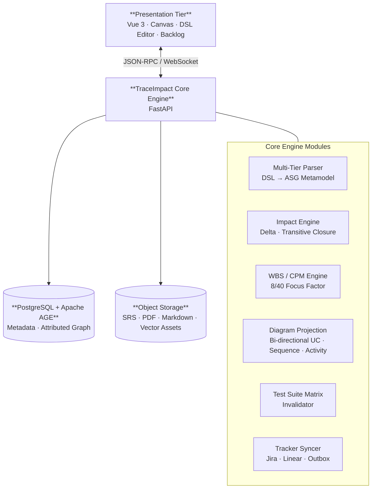
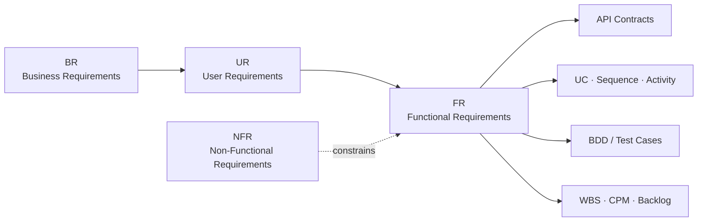

# TraceImpact Studio

### Інформаційна система наскрізного моделювання вимог, динамічного аналізу впливу змін та автоматизованої генерації артефактів життєвого циклу ПЗ

`Academic & Industrial Working Title` · **TraceImpact Studio**

> **Галузь знань:** 12 «Інформаційні технології»  
> **Спеціальність:** F2 (121) «Інженерія програмного забезпечення»

---

## Зміст

- [Проблема](#проблема)
- [Мета та цінність](#мета-та-цінність)
- [Концепція системи](#концепція-системи)
- [Ключові можливості](#ключові-можливості)
- [Модель вимог і трасованість](#модель-вимог-і-трасованість)
- [Розрахунок трудовитрат і планування](#розрахунок-трудовитрат-і-планування)
- [Технологічний стек](#технологічний-стек)
- [English summary](#english-summary)

---

## Проблема

У промисловій розробці ПЗ вимоги, архітектура, QA та планування часто існують у відокремлених інструментах. Такий розрив створює **Requirements Traceability Decay** — поступову втрату актуальних зв’язків між артефактами життєвого циклу.

### Наслідки пізніх змін у специфікації

| Ризик | Практичний наслідок |
|:--|:--|
| Невалідована логіка | Регресійні дефекти та непередбачувані шляхи виконання |
| Застарілі тести | Test suite більше не підтверджує фактичну поведінку системи |
| Неточне планування | Помилки у переоцінці трудовитрат, строків і критичного шляху |

Сучасні рішення зазвичай покривають лише окрему площину: документацію (**Confluence**, **Notion**), схеми (**Draw.io**, **PlantUML**, базовий **Mermaid**) або беклог (**Jira**, **Linear**). Їм бракує спільної семантичної моделі, що реактивно підтримує зв’язки між цими площинами.

## Мета та цінність

**Мета дослідження** — створити модель, алгоритмічний базис і програмну платформу для наскрізної синхронізації вимог, аналізу наслідків змін і автоматизованого формування інженерних артефактів.

TraceImpact Studio перетворює вимоги на керований граф знань: зміна одного атомарного елемента одразу показує, **які діаграми, контракти, тести, задачі та строки потребують перегляду**.

## Концепція системи

### Принцип роботи

1. **Опис** — вимоги вводяться через DSL або візуальний редактор.
2. **Нормалізація** — усі артефакти компілюються в канонічний **Abstract Semantic Graph (ASG)**.
3. **Аналіз** — система порівнює дельту змін і обходить пов’язані вузли графа.
4. **Реакція** — оновлює проєкції діаграм, статуси QA, WBS/CPM та зовнішній беклог.
5. **Публікація** — формує нормалізовану SRS і експортує її у Markdown/PDF та хмарне сховище.

## Ключові можливості

### 01 · Єдине семантичне джерело істини

ASG є **Single Source of Truth**: текстові вимоги, DSL та візуальні елементи зберігаються як типізовані вузли й зв’язки. Це усуває розбіжності між документом і діаграмами.

### 02 · Реактивні діаграми у двох напрямах

**Use Case**, **Sequence** та **Activity** — це проєкції підграфів ASG. Зміна альтернативного потоку в Sequence-діаграмі мутує головний граф і автоматично відновлює пов’язані проєкції без втрати метаданих.

### 03 · Аналіз впливу змін

Для дельти $\Delta V$ та $\Delta E$ обчислюється транзитивне замикання:

$$G^* = (V, E^*)$$

Це дає змогу за поліноміальний час виявити зачеплені функціональні контракти, сценарії та регресійні тести. Пов’язані тести автоматично отримують статус `REQUIRES_REVIEW` або `INVALIDATED`.

### 04 · Трасованість і QA-артефакти

- Синтез **Traceability Matrix** між вимогами, діаграмами, тестами й задачами.
- Генерація шаблонів сценаріїв **Given–When–Then / BDD**.
- Контроль типізованих відношень: `derives_from`, `satisfies`, `verifies`, `conflicts_with`.
- Запобігання висячим та циклічно суперечливим артефактам.

### 05 · Синхронізація з беклогом

| Рівень вимог | Цільовий об’єкт у трекері |
|:--|:--|
| $BR$ | Epic |
| $UR$ | Story |
| $FR$ | Task / Sub-task |
| Дефект трасованості | Bug |

Інтеграція з **Jira** і **Linear** базується на патерні **Transactional Outbox** для ідемпотентності, а конфлікти розв’язуються за допомогою **Vector Clocks**.

## Модель вимог і трасованість

| Рівень | Зміст | Приклади |
|:--|:--|:--|
| **Business Requirements ($BR$)** | Бізнес-цілі та критерії успіху | KPI, ROI, drivers |
| **User Requirements ($UR$)** | Ролі й очікувана взаємодія | Use Cases, user stories |
| **Functional Requirements ($FR$)** | Поведінка та контракти системи | Hoare triples, автомати, API |
| **Non-Functional Requirements ($NFR$)** | Якісні й технічні обмеження | ISO/IEC 25010, безпека, надійність |

## Розрахунок трудовитрат і планування

Платформа декомпозує вимоги на атомарні роботи та застосовує модифікований підхід **Use Case Points (UCP)**:

$$E = UCP \times CF \times \prod_{i=1}^{m} TCF_i \times \prod_{j=1}^{n} ECF_j$$

Тривалість адаптується до промислового режиму **8 год/день · 40 год/тиждень** із коефіцієнтом когнітивного фокусу:

$$T_{effective} = T_{nominal} \times \eta_{focus}, \qquad \eta_{focus} \approx 0.65$$

Далі модуль **CPM** будує критичний шлях і прогнозує дату релізу на основі залежностей між задачами.

## Технологічний стек

| Шар | Технології | Інженерне призначення |
|:--|:--|:--|
| Frontend framework | Vue 3, Composition API, TypeScript | Типобезпечна клієнтська архітектура |
| State management | Pinia, Immer.js | Імутабельний реактивний стан графа |
| Canvas & layout | SVG, Canvas API, WebCola, Dagre-D3 | Компонування графів у реальному часі |
| Backend core | Python, FastAPI, Pydantic v2 | Асинхронна бізнес-логіка та API-контракти |
| Graph processing | NetworkX, rustworkx | Замикання графа, топологічне сортування, CPM |
| Storage & persistence | PostgreSQL, Apache AGE | Реляційні метадані та Cypher-запити |
| Task queue & cache | Redis, Celery / ARQ | Фонові обчислення й webhook-інтеграції |
| Cloud & ecosystem | Jira REST API, Linear SDK, Boto3 / S3 | Синхронізація та публікація артефактів |
| Testing & quality | Pytest, Hypothesis, Playwright | Boundary, property-based та E2E тестування |

---

## English summary

### Software System for End-to-End Requirements Modeling, Dynamic Change Impact Analysis, and Automated Lifecycle Artifacts Generation

**Project name:** TraceImpact Studio

Industrial software teams often maintain requirements, architecture, QA, and planning in separate tools. This fragmentation causes **Requirements Traceability Decay**: late specification changes introduce broken execution paths, obsolete regression suites, and inaccurate delivery estimates.

TraceImpact Studio provides a unified platform built on an **Attributed Directed Graph**, the *Abstract Semantic Graph*. It delivers:

1. **Multi-tier semantic metamodel** — strict links across Business, User, Functional, and Non-Functional requirements.
2. **Two-way reactive diagrams** — continuous synchronization of DSL and Use Case, Sequence, and Activity projections.
3. **Impact and verification analysis** — transitive-closure analysis identifies broken contracts and invalidated tests after a change.
4. **Parametric WBS estimation** — modified UCP estimation calibrated to an 8/40 workweek and an engineer-focus factor ($\eta_{focus}$).
5. **Bi-directional backlog synchronization** — Outbox-driven mapping to Jira/Linear Epics, Stories, Tasks, and Bugs.
6. **IEEE 830 specification compiler** — automated generation and cloud publication of enterprise-grade SRS documentation in Markdown and PDF.

> **Core idea:** every requirement, diagram element, test, task, and document fragment remains traceable through one semantic graph.
