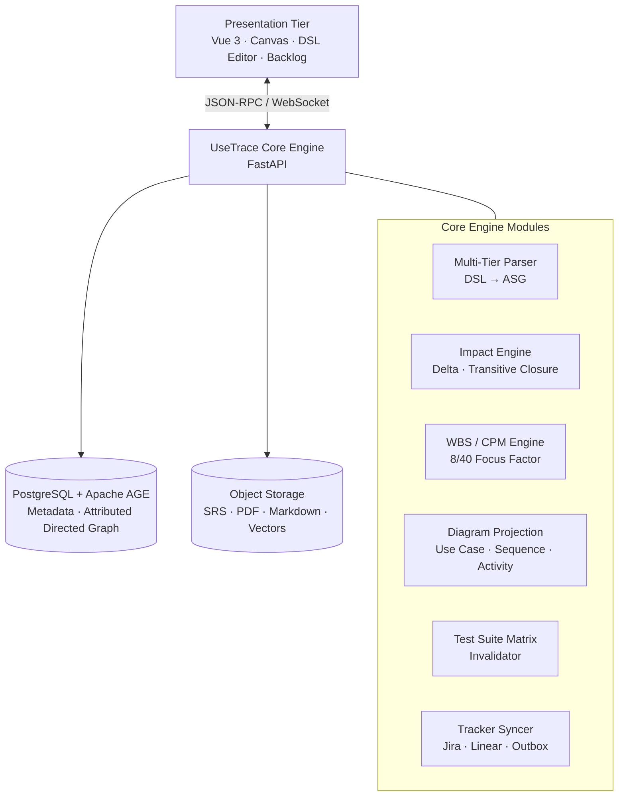
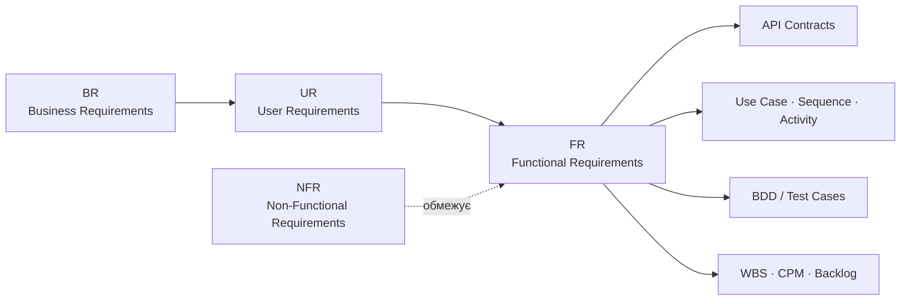
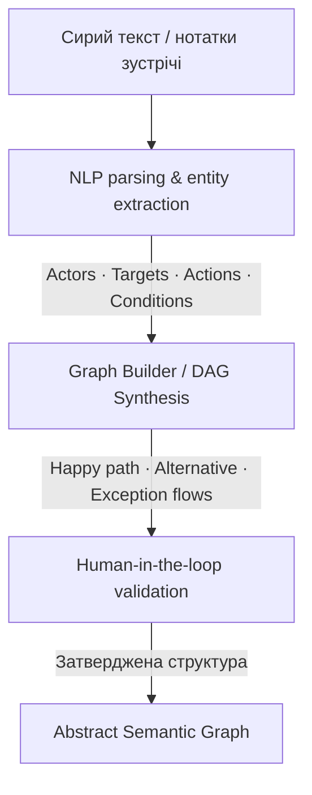

<div align="center">

# UseTrace Studio

### Розробка веб-системи наскрізного моделювання вимог до програмного забезпечення з реактивною двосторонньою генерацією UML-діаграм, верифікаційного беклогу та автоматизованою оцінкою трудовитрат

*Enterprise Requirements Lifecycle, Visual Modeling & WBS Engine*

</div>

> **Галузь знань:** 12 «Інформаційні технології»  
> **Спеціальність:** F2 (121) «Інженерія програмного забезпечення»  
> **Кафедра / інститут:** кафедра ПЗКС, ННІ ФТКН ЧНУ  
> **Виконавець:** Сусла Владислав Валерійович, 4 курс  
> **Науковий керівник:** Комісарчук Володимир Васильович, к. т. н., доцент  
> **Docs-as-Code репозиторій:** [Vlad8800/F2-diploma-project](https://github.com/Vlad8800/F2-diploma-project)

---

## Зміст

- [Проблема](#проблема)
- [Паспорт продукту](#паспорт-продукту)
- [Мета та цінність](#мета-та-цінність)
- [Архітектура системи](#архітектура-системи)
- [Модель вимог і неявні зв’язки](#модель-вимог-і-неявні-звязки)
- [NLP-конвеєр](#nlp-конвеєр)
- [Реактивні діаграми](#реактивні-діаграми)
- [Аналіз впливу змін і QA](#аналіз-впливу-змін-і-qa)
- [WBS 8/40 та планування](#wbs-840-та-планування)
- [Інтеграція з беклогом](#інтеграція-з-беклогом)
- [Експорт і хмарне сховище](#експорт-і-хмарне-сховище)
- [Технологічний стек](#технологічний-стек)
- [English summary](#english-summary)

---

## Проблема

У промисловій розробці ПЗ вимоги, архітектура, QA та планування часто існують у відокремлених інструментах. Це спричиняє **Requirements Traceability Decay** — поступову втрату актуальних зв’язків між артефактами життєвого циклу.

| Ризик | Практичний наслідок |
|:--|:--|
| **Невалідована логіка** | Регресійні дефекти та непередбачувані шляхи виконання. |
| **Застарілі тести** | Набір тестів більше не підтверджує фактичну поведінку системи (*stale test suites*). |
| **Подвійна робота** | Ручне перемальовування схем і повторне внесення задач у трекери. |
| **Неточне планування** | *Estimation Gap*: похибки в оцінці трудовитрат, строків і критичного шляху. |

Документаційні інструменти (Confluence, Notion), редактори діаграм (Draw.io, PlantUML, Mermaid) і трекери задач (Jira, Linear) ефективні у своїх площинах, але не забезпечують спільної семантичної моделі та автоматичного контролю цілісності зв’язків.

## Паспорт продукту

| Параметр | Опис |
|:--|:--|
| **Робоча назва** | **UseTrace Studio** — *Enterprise Requirements Lifecycle, Visual Modeling & WBS Engine*. |
| **Тип ПЗ** | Веб-орієнтована SaaS-система у форматі **Single Page Application (SPA)**. |
| **Призначення** | Інтелектуальне управління вимогами, реактивна генерація візуальних моделей, графова декомпозиція задач, WBS-оцінювання та інтеграція з хмарною інфраструктурою. |
| **Сфера застосування** | Requirements Engineering, системний і бізнес-аналіз, QA, операційний менеджмент розробки ПЗ (Agile / Scrum / Waterfall), аудит документації за IEEE/ISO. |
| **Ключовий результат** | Узгоджений ланцюг «вимога → UML-модель → тест / задача → оцінка → документація». |

### Місія продукту

**UseTrace Studio** усуває розрив між первинним неструктурованим описом ідеї — «зі слів клієнта» — та інженерною реалізацією. Платформа автоматизує до **80% рутинної роботи** з:

- формалізації та структурування вимог;
- побудови трьох типів UML-діаграм;
- розрахунку деталізованого WBS у годинах за моделлю 8/40;
- автогенерації верифікаційного беклогу в трекерах задач;
- розгортання структурованого архіву артефактів у хмарному сховищі.

## Мета та цінність

**Мета дослідження** — створити модель, алгоритмічний базис і програмну платформу для наскрізної синхронізації вимог, аналізу наслідків змін і автоматизованого формування інженерних артефактів.

UseTrace Studio перетворює вимоги на спільний граф знань. Зміна одного атомарного кроку визначає, **які UML-діаграми, контракти, тести, пакети WBS і строки мають бути оновлені**.

## Архітектура системи



### Принцип функціонування

1. **Опис:** аналітик вносить вимоги через внутрішній DSL або візуальний редактор.
2. **Нормалізація:** артефакти компілюються в канонічний **Abstract Semantic Graph (ASG)** — єдине джерело істини.
3. **Аналіз:** система визначає дельту $\Delta$ та транзитивно обходить пов’язані підграфи.
4. **Реакція:** оновлюються UML-проєкції, QA-матриця, оцінки WBS/CPM і зовнішні трекери.
5. **Публікація:** формується нормалізована SRS та структурований архів у хмарному сховищі.

## Модель вимог і неявні зв’язки



| Рівень | Сутності | Візуалізація | Беклог | Метод оцінювання |
|:--|:--|:--|:--|:--|
| **Business Requirements ($BR$)** | Vision & Scope, бізнес-правила, модулі | Карта бізнес-цілей, Context Map | Epic | T-shirt sizing (XS–XL) |
| **User Requirements ($UR$)** | Актори, сценарії, user stories | UML Use Case, User Journey | User Story | Story points (Fibonacci) |
| **Functional Requirements ($FR$)** | Кроки сценаріїв, Hoare triples, API-контракти | UML Sequence, Activity | Task / Sub-task | WBS packages, години |
| **Non-Functional Requirements ($NFR$)** | Метрики ISO/IEC 25010, SLA, rate limits | Специфікація обмежень | Infra task, bug template | Фактори складності ($TCF$) |

### Implicit Requirements Engine

Семантичний аудит графа виявляє приховані архітектурні вимоги ще до реалізації:

- **Тайм-аути та відмови API:** інтеграція із зовнішнім сервісом породжує гілки `503`/`504 Timeout Exception Flow`.
- **Ідемпотентність транзакцій:** фінансові та інші мутуючі операції отримують вимогу захисту від повторних запитів (*network retry* / *double submit*).
- **Компенсуючі транзакції:** збої під час збереження стану породжують сценарії відкату та збереження консистентності.

## NLP-конвеєр



- **Сегментація сутностей:** вилучення ролей (Human/System Actors) і цільових систем: API, БД, шини черг.
- **Семантичний аналіз розгалужень:** розпізнавання маркерів «якщо», «інакше», «у разі збою» для розділення основних, альтернативних і виняткових потоків.
- **Генерація структури:** автоматичне створення вершин і ребер графа з можливістю drag-and-drop валідації аналітиком.

## Реактивні діаграми

Система транслює підграфи ASG у векторні діаграми через Mermaid.js або PlantUML:

| Діаграма | Що відображає |
|:--|:--|
| **UML Use Case** | Межі системи, акторів, зв’язки `<<include>>` та `<<extend>>`. |
| **UML Sequence** | Хронологію взаємодії компонентів, `alt`/`else`, `loop`, `par` і статус-коди. |
| **UML Activity** | Операційний потік від Start Node до Final State через точки розгалуження. |

**Two-Way Reactivity:** зміна текстового або табличного опису оновлює SVG-діаграми; редагування елемента на полотні мутує вузли ASG і перераховує всі залежні артефакти.

## Аналіз впливу змін і QA

Для дельти змін $\Delta V$ та $\Delta E$ формується транзитивне замикання:

$$G^* = (V, E^*)$$

```text
Зміна кроку вимоги або Use Case
                │
                ▼
       Diff & Impact Analyzer
          ┌─────┴─────┐
          ▼           ▼
  Зачеплені тести   Зачеплені WBS-задачі
  REQUIRES_REVIEW   Оновлення нормо-годин
  або INVALIDATED   і синхронізація Jira / Linear
```

- **Traceability Matrix:** автоматичне покриття позитивних (*happy path*) і негативних (*exception flow*) шляхів за допомогою DFS/BFS.
- **BDD-генерація:** створення тестових сценаріїв у форматі `Given–When–Then`.
- **Контроль зв’язків:** типи `derives_from`, `satisfies`, `verifies`, `conflicts_with` запобігають висячим вузлам і суперечливим циклам.

## WBS 8/40 та планування

Функціональна вимога декомпозується на атомарні інженерні задачі:

$$\text{Functional Step} \longrightarrow \text{Work Package} = \{\text{UI Task},\ \text{Backend Endpoint},\ \text{DB Migration},\ \text{QA Unit/E2E}\}$$

### Нормативи декомпозиції

| Тип дії | Робочий пакет WBS | Базовий норматив |
|:--|:--|:--|
| Користувацький ввід / форма | UI-компонент, маска вводу, клієнтська валідація | 4–6 год |
| Серверна бізнес-логіка | Контролер, сервісний шар, DTO-валідація, авторизація | 5–8 год |
| Операція з БД | Міграція, індекси, транзакційний репозиторій | 3–5 год |
| Зовнішній сервіс / API | SDK-модуль, помилки, повторні спроби | 6–10 год |
| Обробка винятку | Error handler, логування, локалізація, UI-нотифікація | 2–4 год |
| Фонова черга / worker | Конфігурація RabbitMQ/Celery, worker | 5–8 год |

Оцінка спирається на модифікований метод Use Case Points:

$$E = UCP \times CF \times \prod_{i=1}^{m} TCF_i \times \prod_{j=1}^{n} ECF_j$$

Модель 8/40 приймає $\eta_{focus} = \frac{5}{8} = 0.625$: п’ять годин чистого технічного часу на добу.

$$T_{total\_hours} = \sum_{i=1}^{m} T_{work\_package_i}$$

$$D_{working\_days} = \frac{T_{total\_hours}}{5\ \text{год/день}}, \qquad W_{weeks} = \frac{T_{total\_hours}}{25}$$

Алгоритм **Critical Path Method (CPM)** знаходить критичний шлях у топологічно впорядкованому графі робіт і прогнозує дату релізу.

## Інтеграція з беклогом

Патерн **Transactional Outbox** забезпечує ідемпотентний експорт у Jira через REST API та Linear через GraphQL API. Паралельні зміни статусів узгоджуються механізмом **Vector Clocks**.

```text
[EPIC] Авторизація та керування сесіями  ·  T-shirt: M  ·  WBS: 48 год
│
└── [USER STORY] Вхід клієнта з двофакторною автентифікацією  ·  5 SP
    │   Linked artifact: UC-01-Use-Case-Diagram.svg
    ├── [TASK · UI] Форма 2FA з таймером оновлення SMS-коду        · 5 год
    ├── [TASK · Backend] POST /auth/verify-otp + rate limit         · 7 год
    ├── [TASK · DB] Поля 2fa_secret, otp_attempts у таблиці users   · 3 год
    └── [BUG TEMPLATE] Вичерпання ліміту спроб, Exception Flow 2b   · High
```

## Експорт і хмарне сховище

Система підтримує AWS S3, Google Drive API та WebDAV і розгортає уніфіковану структуру артефактів, сумісну з IEEE 830 / ISO/IEC/IEEE 29148.

```text
📁 [Project_Name]_v1.0_System_Requirements_Hub/
├── 📁 01_Business_Requirements/
│   ├── Vision_and_Scope_Specification.pdf
│   └── Epics_and_T_Shirt_Estimates.xlsx
├── 📁 02_User_Requirements/
│   ├── User_Stories_Backlog.xlsx
│   └── Use_Case_Diagrams/
│       ├── UC_Overview_All_Actors.svg
│       └── UC_Module_Details.svg
├── 📁 03_Functional_Requirements/
│   ├── IEEE_830_SRS_Specification.pdf
│   ├── Sequence_Diagrams/
│   │   ├── UC01_Happy_Path.svg
│   │   └── UC01_Exceptions.svg
│   └── Activity_Diagrams/UC01_Process_Flow.svg
├── 📁 04_Verification_and_QA/
│   ├── Traceability_Matrix_RTM.xlsx
│   ├── Generated_Test_Cases_TestRail.csv
│   └── Change_Impact_Audit_Log.json
└── 📁 05_Project_Estimates_and_WBS/
    ├── Full_Work_Breakdown_Structure_WBS.xlsx
    └── Resource_Calendar_Schedule_8_40.pdf
```

## Технологічний стек

| Шар | Технології | Інженерне призначення |
|:--|:--|:--|
| Frontend framework | Vue 3, Composition API, TypeScript | Типобезпечна реактивна SPA |
| State management | Pinia, Immer.js | Імутабельний стан графа, single source of truth |
| UI & interactivity | Tailwind CSS, PrimeVue, `@vuedraggable` | Адаптивний інтерфейс, split panels, drag-and-drop |
| Canvas & layout | Mermaid.js, SVG / Canvas API, WebCola, Dagre-D3 | Лейаут і live-preview діаграм |
| Backend core | Python, FastAPI, Pydantic v2 | Асинхронна бізнес-логіка та DTO-контракти |
| Graph processing | NetworkX, rustworkx | DFS/BFS, замикання, топологічне сортування, CPM |
| Storage & persistence | PostgreSQL, SQLAlchemy v2, Alembic, Apache AGE | Реляційно-графове збереження і Cypher-запити |
| Task queue & cache | Redis, Celery / ARQ | Фонові розрахунки й webhook-workers |
| Cloud & ecosystem | Jira REST API v3, Linear GraphQL API, Boto3, Google Drive API | Синхронізація беклогу та публікація |
| Reporting & export | openpyxl / exceljs, WeasyPrint | Excel/CSV-матриці та PDF за IEEE 830 |
| DevOps & verification | Docker, Docker Compose, GitHub Actions, Pytest, Playwright, SonarCloud, Trivy | CI/CD, тестування й аудит безпеки |

---

## English summary

### Web System for End-to-End Software Requirements Modeling, Reactive Two-Way UML Generation, Verification Backlog, and Automated Effort Estimation

**Project name:** UseTrace Studio  
*Enterprise Requirements Lifecycle, Visual Modeling & WBS Engine*

Industrial software teams often maintain requirements, architecture, QA, and planning in isolated toolchains. This fragmentation causes **Requirements Traceability Decay**: late specification changes introduce broken execution paths, obsolete regression suites, and inaccurate delivery estimates.

UseTrace Studio is a web-oriented SaaS Single Page Application built around an **Attributed Directed Graph**, the **Abstract Semantic Graph (ASG)**, which acts as the single source of truth. Its mission is to bridge informal client descriptions and engineering implementation by automating requirements formalization, UML modeling, verification-backlog generation, 8/40 WBS estimation, and cloud artifact publishing.

It provides:

1. **Multi-tier semantic metamodel** — strict typing across Business, User, Functional, and Non-Functional requirements, with implicit-requirement detection.
2. **Two-way reactive diagrams** — continuous bi-directional synchronization of DSL and Use Case, Sequence, and Activity projections.
3. **Impact and verification analysis** — transitive-closure analysis identifies broken contracts and obsolete test suites after a change.
4. **Parametric WBS estimation** — algorithmic work-breakdown estimation calibrated to an 8/40 workweek and engineer-focus factor $\eta_{focus} = 0.625$, with CPM scheduling.
5. **Bi-directional backlog synchronization** — Outbox-driven mapping to Jira/Linear Epics, Stories, technical tasks, and bug templates.
6. **IEEE 830 specification compiler** — automated generation and cloud publication of enterprise-grade Markdown and PDF specifications.

> **Core idea:** every requirement, diagram element, test, task, and document fragment remains traceable through one semantic graph.
